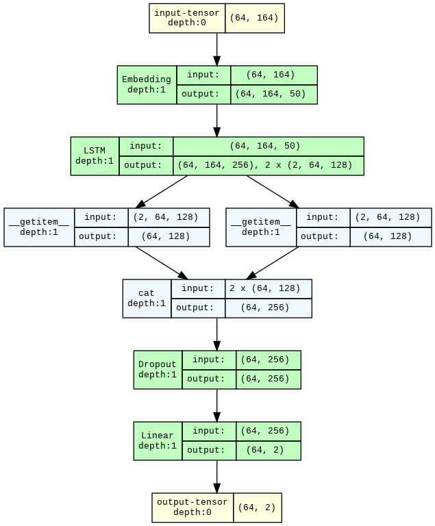

# Sexism Detection

## Introduction

This repository hosts the code and reports for the Natural Language Processing course assignments of the Master Degree in Artificial Intelligence at University of Bologna.

## Authors

- [Matteo Fasulo](https://github.com/MatteoFasulo)
- [Luca Babboni](https://github.com/ElektroDuck)
- [Maksim Omelchenko](https://github.com/omemaxim)
- [Luca Tedeschini](https://github.com/LucaTedeschini)

## Assignment 1: Sexism detection using LSTMs and pre-trained transformers

Assignment 1 addresses [**sEXism Identification in Social neTworks (EXIST) 2023 Task 1**](https://nlp.uned.es/exist2023/) focusing on the classification of text as sexist or not.

According to the Oxford English Dictionary, sexism is defined as "prejudice, stereotyping, or discrimination, typically against women, on the basis of sex."

Our goal is to leverage advanced natural language processing techniques to accurately identify sexist language. The dataset used in this project is provided by the EXIST 2023 organizers and has been meticulously annotated by six trained experts.

The EXIST 2023 challenge introduces a novel approach by incorporating sexism identification within the learning with disagreements paradigm. This paradigm acknowledges the potential for label bias due to socio-demographic differences among annotators and the subjective nature of labeling. Unlike previous challenges, this approach allows systems to learn from datasets without definitive gold annotations, capturing a range of perspectives by providing all annotators' inputs.

### Models for Assignment 1

- Bidirectional LSTM with pre-trained GloVe embeddings

  

- [Fine-tuned roBERTa for hate speech detection](https://huggingface.co/cardiffnlp/twitter-roberta-base-hate)

> [!TIP]
> Explore the interactive dashboard, built with [**Gradio**](https://www.gradio.app/), which showcases the fine-tuned models on the dataset. This user-friendly interface allows you to test the models in real-time. Check it out here: [**Sexism Detection Dashboard**](https://huggingface.co/spaces/MatteoFasulo/Sexism-Detection-Dashboard)

## Assignment 2: Sexism detection using zero-shot and few-shot learning

Assignment 2 address [**Explainable Detection of Online Sexism (EDOS) Task A**](https://arxiv.org/abs/2303.04222) challenge from SemEval 2023.

This task addresses the critical issue of online sexism, which can harm women, make digital spaces unwelcoming, and perpetuate social injustices. While automated tools are widely used to detect sexist content, they often lack detailed explanations, leading to confusion and mistrust among users and moderators.

Task A is a binary classification problem that requires systems to predict whether a given content is sexist or not.

The task is unique due to its diverse data sourced from Reddit and Gab, high-quality annotations by trained women to mitigate bias.

### Models for Assignment 2

- [Mistral-7B-Instruct-v0.3](https://huggingface.co/mistralai/Mistral-7B-Instruct-v0.3)
- [Llama-3.1-8B-Instruct](https://huggingface.co/meta-llama/Llama-3.1-8B-Instruct)

### Pipeline for Assignment 2

  

## Reports

- 📄 [EXIST 2023 Task 1 Report](https://matteofasulo.github.io/Sexism-detection/reports/NLP_Assignment_1.pdf)
- 📄 [EDOS Task A Report](https://matteofasulo.github.io/Sexism-detection/reports/NLP_Assignment_2.pdf)

## License

This project is licensed under the MIT License. Feel free to use, modify, and distribute this code as you see fit. See the [LICENSE](LICENSE) file for more details.
